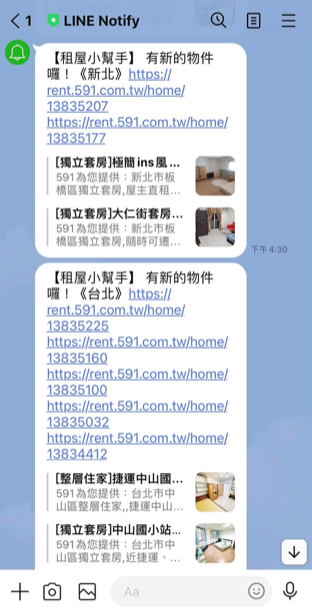
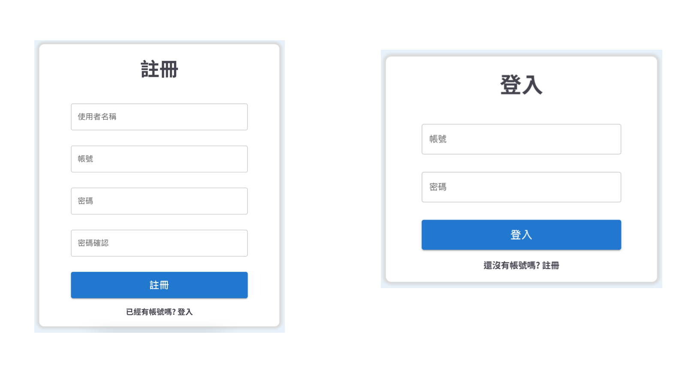
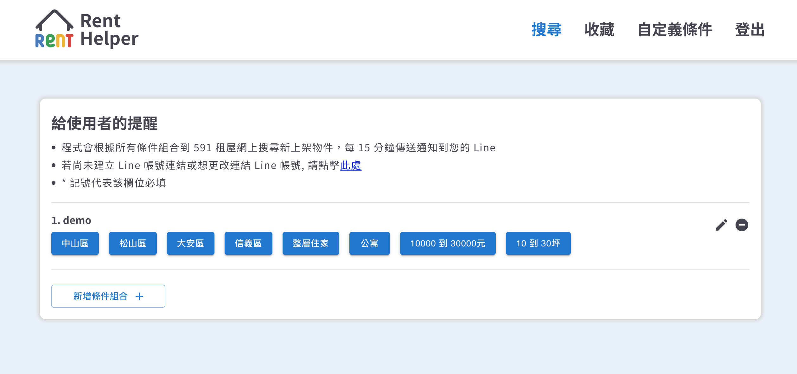
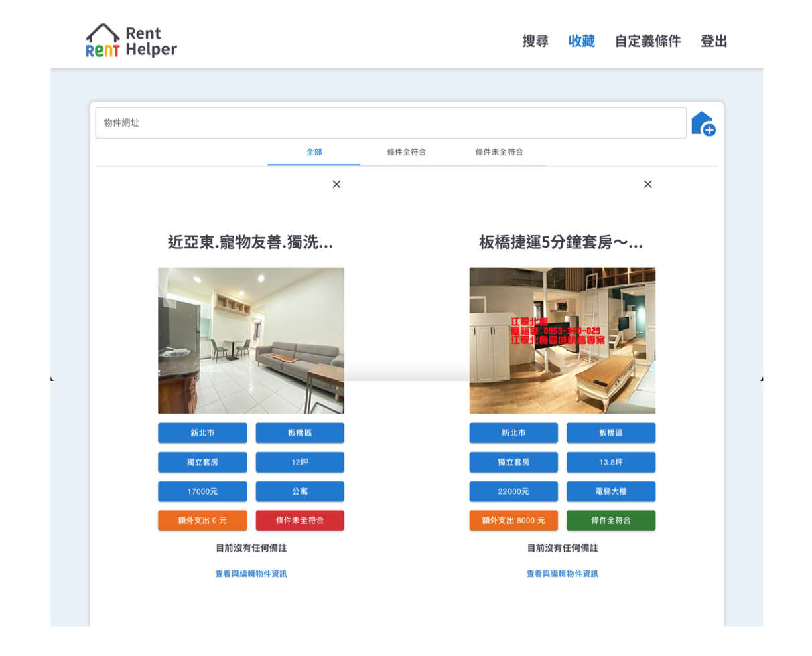
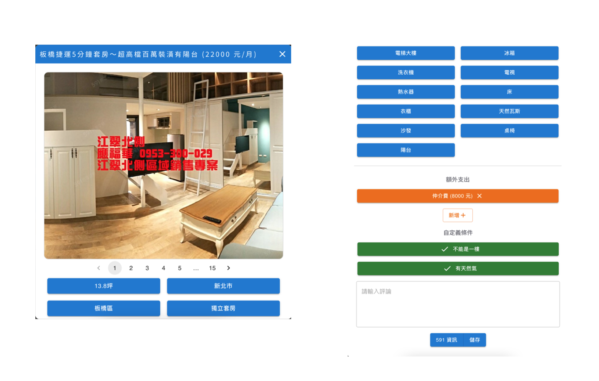

# Rent Helper API

### [Rent Helper - 租屋小幫手](https://y0000ga.github.io/rent-helper/)

Rent Helper API 是一個使用 Node.js, Express, MySQL, LineNotify打造的後端專案，搭配前端專案 [Rent Helper](https://github.com/y0000ga/rent-helper)，讓使用者能在Line上接收最新的591租屋資訊，並可在網站上收藏感興趣的物件。
### 【Line通知】

### 【註冊與登入】

### 【搜尋條件】

### 【收藏清單】

### 【個別物件】


## 測試帳號
測試帳號密碼 **(已和其他 Line 帳號連結，故僅供平台操作，若需要使用 Line 通知服務，請自行註冊新的帳號密碼)**
```
帳號：testuser
密碼：Testuser1!
```

## 專案功能

- 使用者創建帳號後可以建立自己的搜尋條件
  - 支援台北市與新北市部分行政區
  - 支援月租金50000以下與坪數50坪以下
- 使用者可以在Line上接收到符合搜尋條件的最新591物件資訊
- 使用者可以貼上591頁面的網址，收藏感興趣的591物件，物件基本資訊將自動代入
  - 名稱
  - 地區
    - 支援台北市與新北市部分行政區
  - 類型與型態
  - 租金與坪數
  - 照片
  - 設備
- 使用者可以對個別物件撰寫自己的備註
- 使用者可以對個別物件增加潛在額外支出
- 使用者可以設定額外的自定義條件
- 使用者可以設定個別物件是否符合自定義條件
- 使用者可以在收藏總覽頁面依據是否符合自定義條件篩選


## API 文件

- [Rent Helper API Docs](https://www.notion.so/Rent-Helper-API-Docs-d9ddaaabeb5843ea9f5924a018c4bd29)

## 環境建置

- [Node.js](https://nodejs.org/en/)
- [MySQL](https://www.mysql.com/) 
## 本地安裝流程

1. 打開terminal，clone此專案至本機電腦

```
git clone https://github.com/SimonHung8/rent-helper-api.git
```

2. 進入專案資料夾

```
cd rent-helper-api
```

3. 安裝需要套件

```
npm install
```

4. 依照.env.example設定環境變數.env

```
JWT_SECRET=<your JWT secret>
LINE_CLIENT_ID=<your Line notify client id>
LINE_CLIENT_SECRET=<your line notify client secret>
LINE_REDIRECT_URI=<your line notify redirect URI>
FRONTEND_ORIGIN=<前端網域>
PORT=<本地運行的port>
FREQUENCY=<對591請求的頻率> //請使用cron的格式，建議最少以分鐘為單位
```
5. 打開MySQL Workbench建立資料庫

```
create database rent_helper;
```

6. 回到terminal進行資料庫設定

```
npx sequelize db:migrate
```

7. 建立種子檔案

```
npx sequelize db:seed:all
```

8. 啟動應用程式

```
npm run start
```
啟動成功後，在terminal中會顯示
```
Rent Helper starts
```
## 開發人員

[Simon Hung](https://github.com/SimonHung8) (後端)

[Yoga Huang](https://github.com/y0000ga) (前端)

## 備註
- 若部署至Heroku，休眠下排程不會執行
- 聯絡方式: simon850226@gmail.com


